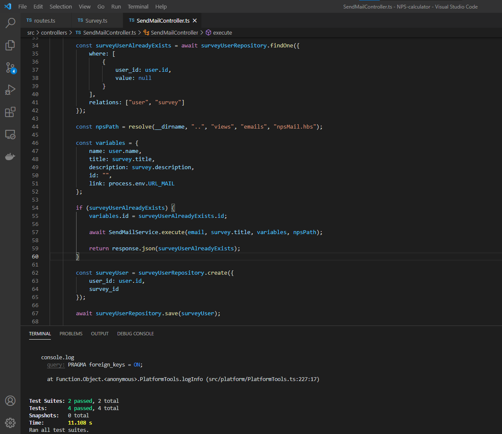

<h1 align="center">NPS-calculator</h1>

<p align="center">
    <a href="#technologies">Technologies</a>&nbsp;&nbsp;&nbsp;|&nbsp;&nbsp;&nbsp;
    <a href="#project">Project</a>&nbsp;&nbsp;&nbsp;|&nbsp;&nbsp;&nbsp;
    <a href="#diagram">Diagram</a>&nbsp;&nbsp;&nbsp;|&nbsp;&nbsp;&nbsp;
    <a href="#how-to-run">How to run</a>&nbsp;&nbsp;&nbsp;|&nbsp;&nbsp;&nbsp;
    <a href="#license">License</a>
</p>

<p align="center">
    
</p>

<br>

<p align="center">
    
</p>

## Technologies

This project was developed with the following technologies:

- [TypeScript](https://www.typescriptlang.org)
- [Node.js](https://nodejs.org)
- [Yarn](https://yarnpkg.com/)
- [Docker](https://www.docker.com/)
- [Nodemailer](https://nodemailer.com)
- [Ethereal-Email](https://ethereal.email)
- [TypeORM](https://typeorm.io/#/)
- [Express](https://expressjs.com/)
- [Handlebars](https://handlebarsjs.com/)
- [Jest](https://jestjs.io/)
- [SQLite3](https://sqlite.org)

## Project

The NPS-calculator is an application that calculates a company's NPS (Net Promoter Score). We register user, survey, send email to users answer the surveys and then calculate the NPS.

## Diagram


## How to run

### Locally

Prerequisites:

Download and install [Node.js](https://nodejs.org/en/download/) and [Yarn](https://classic.yarnpkg.com/en/docs/install/)

<br>

- Clone the repository
- Install the dependencies with [`yarn` command](https://classic.yarnpkg.com/en/docs/usage):
```
yarn
```

<br>

To start the server:
```
yarn dev
```

<br>

To run the tests:
```
yarn test
```

<br>

The application can be accessed at [`localhost:3333`](http://localhost:3333).

<br>

### Docker container

Prerequisites:

Download and install [Docker](https://www.docker.com/products/docker-desktop)

<br>

- Clone the repository
- Build the image with the command:
```
docker build -t <username>/<app-name> .
```
- Run the image with the command:
```
docker run -p 49160:3333 -d <username>/<app-name>
```

<br>

The application can be accessed at [`localhost:49160`](http://localhost:49160) .

## License

Licensed under [MIT](LICENSE.md) license.